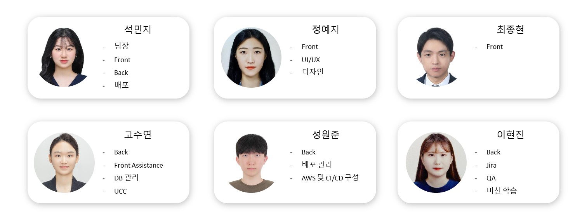
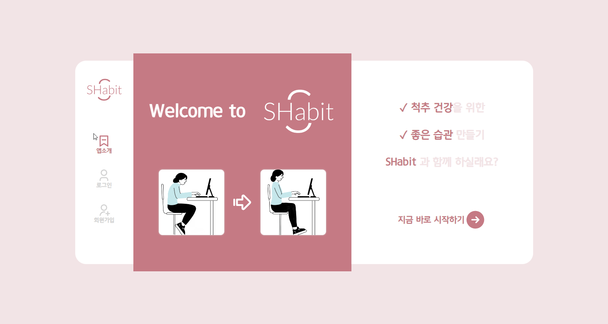
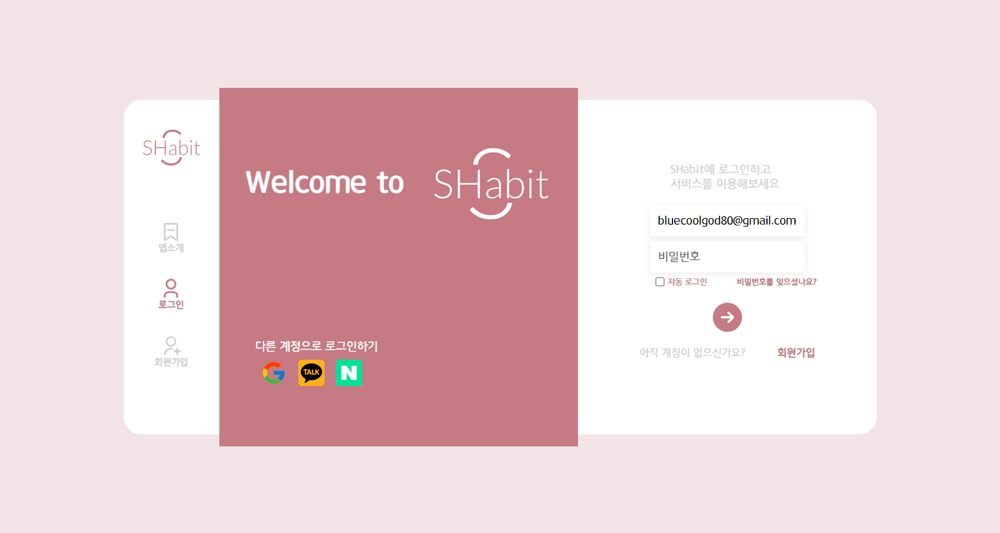
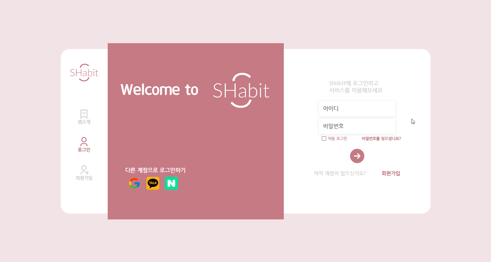
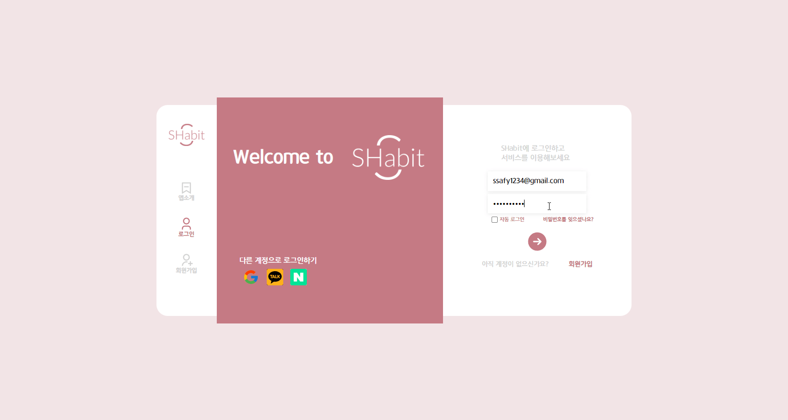
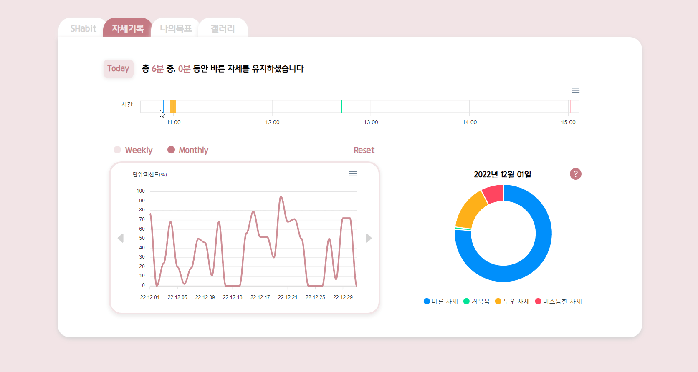

#  SHabit - 올바른 자세 습관을 만들도록 도와주는 사이트


## SHabit 링크(웹사이트) : [SHabit](https://shabit.site/)

## 소개 영상 보기 : 
https://user-images.githubusercontent.com/77595685/230024164-640b127e-7c37-4023-ae20-712fc7848097.mov

## 개발 과정 보기 : [Notion](https://relieved-cave-3bc.notion.site/SHabit-d3967a3cf3e440fa82292323d28fb0d6)

## 🏆 공통 프로젝트 우수상

<br>

## 🌸 프로젝트 진행 기간

2023.01.03(화) ~ 2023.02.17(금) (46일간 진행)  
SSAFY 8기 2학기 공통프로젝트 - SHabit

</br>

## 🎀 SHabit - 배경

컴퓨터 앞에 앉아서 일하시면서 거북목이 되어가고있지 않으신가요? 하지만 일을 하는 도중 자세가 흐트러진 것을 확인하기가 쉽지않죠!

SHabit은 안좋은 자세 습관을 고치는 것을 도와주는 웹사이트입니다. SHabit과 함께라면, 목표를 세워 좋은 자세 습관을 기를 수 있습니다.

</br>

## 🌸 SHabit - 개요

_- 척추 건강을 위한 좋은 습관을 만들자 -_

SHabit는 <span style="color:#C57A84; font-weight:bold;">S</span>tretching <span style="color:#C57A84; font-weight:bold;">Habit</span>의 약자입니다.  
SHabit은 사용자의 자세를 트래킹하여 올바르지 않은 자세를 유지할 시 경고해주고, 좋은 습관을 위해 정해진 시간마다 스트레칭을 추천하여 습관을 고치는 데에 도움을 주는 웹서비스입니다.

개인이 컴퓨터를 사용할 때 자세가 쉽게 흐트러진다는 점을 고려하여 <span style="color: #C57A84; font-weight: bold;">SHabit</span>은 개인이 사용하는 웹사이트로 개발되었습니다. 따라서 쉽고 간편하게 사용할 수 있습니다. 또한, 목표를 세워 현재 수치와 비교하며 경각심을 가질 수 있습니다.

</br>

## 🌸 주요 기능

---

### 자세 트래킹

    - Teachable Machine을 사용하여 자세를 트래킹합니다.
    - webRTC의 getUserMedia()를 사용하여 user의 카메라에 접근하고 mediastream recording api를 활용하여 SHabit 사용하는 모습을 녹화합니다.
    - 좋지 않은 자세가 정해진 시간(default 3분) 이상 지속되면 경고 차원에서 크롬 알림이 뜹니다.
    - 정해진 시간(default 50분)마다 크롬 알림이 뜨고, 이를 클릭하여 스트레칭을 시작할 수 있습니다.
    - 영상은 3분, 5분, 10분 단위로 제공되며, 전 데이터를 토대로 적절한 부위(거북목, 허리, 전신)의 스트레칭 영상을 추천해줍니다.
    - 자세가 바뀔 때마다 영상을 캡처하여 DB에 저장합니다.

### 트래킹 종료

    - 나가기 버튼을 통해 나갈 수 있습니다.
    - 1분마다 1초씩 찍어진 영상을 이어 만든 클립을 보거나 다운로드 할 수 있습니다.

### 메인 페이지

    - 회원 정보, 마지막 접속일, 건강 문구를 확인할 수 있습니다.
    - 회원이 접속하여 올바른 자세를 취한 percentage를 바탕으로 만든 heatmap(잔디)을 확인할 수 있습니다.
    - 테마의 색을 클릭하여 테마 색상을 변경할 수 있습니다.
    - 프로필 사진을 클릭하여 변경할 수 있습니다.

### 자세기록 페이지

    - 상단 문구를 통해 오늘 총 몇 시간 사용했고, 몇 분 바른 자세를 유지했는지 알 수 있습니다.
    - range bar graph를 통해 사용 시각과 그때 유지한 자세를 한눈에 확인할 수 있습니다.
    - line graph를 통해 하루 단위로 몇퍼센트 바른 자세를 유지했는지 알 수 있습니다.
      - weekly와 monthly로 구분하여 한눈에 확인할 수 있습니다.
      - line graph에서 특정 날짜를 클릭하면 우측에 pie graph가 나타납니다. 해당 일에 어떤 자세를 몇퍼센트 유지했는지 쉽게 확인이 가능합니다.
    - range bar graph와 line graph는 svg, png, csv 파일로 저장 가능합니다.

### 나의목표 페이지

    - 목표 달성 칸에서 내가 설정한 목표(percentage, 시간)와 오늘 달성 정도를 확인할 수 있습니다.
      - 오른쪽 상단 수정 버튼을 통해 목표를 직접 설정할 수 있습니다.
    - 자세 유지 시간 칸에서는 오늘 사용한 총 시간 대비 유지한 자세를 한 눈에 확인할 수 있도록 bar graph를 제공하고있습니다.
    - 이 페이지는 오른쪽 상단 다운로드 버튼을 통해 페이지 이미지를 손쉽게 저장할 수 있습니다.

### 갤러리

    - 트래킹을 하면서 찍은 사진들을 확인할 수 있습니다.
    - 바른 자세, 거북목 자세, 비스듬한 자세, 누운 자세별로 구분하여 볼 수 있습니다.

</br>

## ✔ 주요 기술

---

**Backend - Spring**

- IntelliJ IDE
- Springboot 3.0.1
- Spring Data JPA
- Spring Security
- Spring Validation
- Spring Web
- QueryDSL
- WebRTC
- WebSocket
- Redis
- MariaDB
- MongoDB
- GCP
- Swagger 3.0.0
- JWT

**Frontend**

- React
- Redux Toolkit
- Styled Components
- TypeScript
- SockJS-client
- Teachable Machine
- React-Webcam
- Axios
- ApexCharts

**CI/CD**

- AWS EC2
- AWS S3
- Jenkins
- NGINX

## ✔ 프로젝트 파일 구조

---

### Back

```
shabit
  ├── admin
  │   ├── controller
  │   ├── dto
  │   │    ├── req
  │   │    └── res
  │   ├── entity
  │   ├── repository
  │   └── service
  │        └── youtube
  ├── config
  │   ├── oauth
  │   │    ├── entity
  │   │    ├── exception
  │   │    ├── handler
  │   │    ├── info
  │   │    |    └── impl
  │   │    ├── repository
  │   │    ├── service
  │   │    └── utils
  │   └── security
  ├── goal
  │   ├── controller
  │   ├── dto
  │   │    ├── req
  │   │    └── res
  │   ├── entity
  │   ├── repository
  │   └── service
  ├── info
  │   ├── controller
  │   ├── dto
  │   │    ├── req
  │   │    └── res
  │   ├── entity
  │   ├── repository
  │   └── service
  ├── jwt
  ├── statistics
  │   ├── controller
  │   ├── dto
  │   │    ├── req
  │   │    └── res
  │   ├── entity
  │   ├── repository
  │   └── service
  ├── user
  │   ├── controller
  │   ├── dto
  │   │    ├── req
  │   │    └── res
  │   ├── entity
  │   ├── enums
  │   ├── repository
  │   └── service
  └── util
```


### Front

```
shabit-front
  ├── node_modules
  ├── public
  │    ├── assets
  │    │   └── fonts
  │    └── my_model
  └── src
      ├── components
      │    ├── Admin
      │    ├── authTest
      │    ├── Chart
      │    ├── common
      │    ├── Landing
      │    ├── Main
      │    ├── OAuth
      │    ├── Posture
      │    └── TeachableMachineTest
      ├── pages
      ├── services
      │   ├── admin
      │   |   └── get
      │   ├── auth
      │   |   ├── delete
      │   |   ├── get
      │   |   ├── post
      │   |   └── put
      │   ├── info
      │   └── stat
      ├── store
      ├── styles
      └── utils
```

## ✔ 협업 툴

---

- Git
- Notion
- JIRA
- MatterMost

## ✔ 협업 환경

---

- Gitlab
  - 코드의 버전을 관리
  - gitlab flow로 관리
  - 자동 배포(main branch, dev branch-backend)
- JIRA
  - 매주 목표량을 설정하여 Sprint 진행
  - 업무의 할당량을 정하여 Story Point를 설정하고, In-Progress -> Done 순으로 작업
- 회의
  - 아침 스크럼 진행, 전에 한 일과 당일 할 업무 브리핑
  - 매 주 첫 만남때마다 스프린트 진행하여 Back 진행상황과 Front 진행상황을 공유
- Notion
  - 회의가 있을때마다 회의록을 기록하여 보관
  - 기술확보 시, 다른 팀원들도 추후 따라할 수 있도록 보기 쉽게 작업 순서대로 정리
  - Error 발생 시, 팀원들이 추후 같은 에러로 고생하지 않도록 정리
  - 컨벤션 정리
  - ERD, 시퀀스다이어그램, 기능명세서 등 모두가 공유해야 하는 문서 관리

## ✔ 팀원 역할 분배

---



## ✔ 프로젝트 산출물

---

- [기능명세서](./docs/shabit\_기능 명세.png)
- [디자인](./docs/shabit_figma.pdf)
- [유저 시나리오](./docs/shabit\_유저 시나리오.md)
- [시퀀스다이어그램](./docs/시퀀스다이어그램.md)
- [아키텍처](./docs/shabit_아키텍처.jpg)
- [API](./docs/API설계.png)
- [ERD](./docs/shabit_erd.png)
- [회의록](./docs/회의록.md)
- [테스트 시나리오]()

## ✔ 프로젝트 결과물

- [포팅메뉴얼](./exec/Porting_Manual.pdf)
- [시연시나리오](./exec/시연_시나리오.pdf)
- [중간발표자료](./docs/shabit_중간발표.pdf)
- [최종발표자료](./docs/shabit_최종발표.pdf)

## 🌸 SHabit 서비스 화면

---

### 랜딩 페이지


<br>

### 로그인 화면




<br>

### 회원 가입 화면


<br>

### 비밀번호 초기화 화면


<br>

### 메인 화면




<br>

### 트래킹 화면


<br>

### 자세 기록 화면



<br>

### 나의 목표 화면


<br>

### 갤러리 화면


<br>

### 관리자 화면


